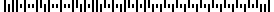
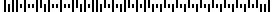

# php-jp-customer-barcode-generator


[](https://coveralls.io/github/pinekta/php-jp-customer-barcode-generator?branch=master)


<!--
badge
logo image
-->

「php-jp-customer-barcode-generator」はフレームワークに依存せず簡単に使えるPHPで書かれた日本郵便のカスタマバーコードジェネレーターです。
SVG、PNG、JPG、HTML形式でカスタマバーコードを生成します。
なお、PHP5.4.0以上じゃないと動作しません。

英語のREADMEは[こちら](./README.md) 

## インストール

```
composer require pinekta/php-jp-customer-barcode-generator
```

もしPNGやJPGで生成したい場合、GDかImagickがインストールされている必要があります。

## 使い方

```php
<?php

// SVG
$generator = new Pinekta\JPCustomerBarcode\BarcodeGeneratorSVG();
echo $generator->getBarcode('104-0045', '東京都中央区築地2-3-4');

// HTML
$generator = new Pinekta\JPCustomerBarcode\BarcodeGeneratorHTML();
echo $generator->getBarcode('104-0045', '東京都中央区築地2-3-4');

// PNG
$generator = new Pinekta\JPCustomerBarcode\BarcodeGeneratorPNG();
echo 'getBarcode('104-0045', '東京都中央区築地2-3-4')) . '">');

// JPG
$generator = new Pinekta\JPCustomerBarcode\BarcodeGeneratorJPG();
echo 'getBarcode('104-0045', '東京都中央区築地2-3-4')) . '">');
```

### 生成されたカスタマバーコードのサンプル

#### SVG


#### HTML

[HTML](./sample/sample.html)

#### PNG



#### JPG



## 日本郵便 カスタマバーコード付番事例とのチェック結果

[日本郵便 カスタマバーコード付番事例（検証用）](https://www.post.japanpost.jp/zipcode/zipmanual/p25.html) に記載されている例で出力された結果は以下のHTMLにあります。

<!--
## Documentation

Comming soon...
-->

## コントリビュート

コントリビュート大歓迎です！
[こちらのリンク](./CODE_OF_CONDUCT.md) と [ガイドライン](./CONTRIBUTING.md) を守っていただけると幸甚です。

## Copyright

copyright © [@pinekta](https://github.com/pinekta).

## License

「pinekta/php-jp-customer-barcode-generator」はMITライセンスです。
詳しくは [LICENSE](./LICENSE) をご参照ください。
